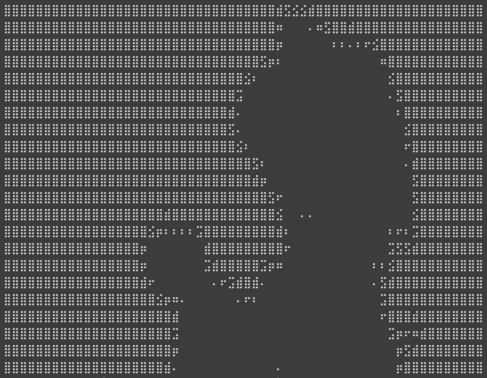

# About

This is a Discord bot which replies a random frame of the very famous video [*【東方】Bad Apple!!　ＰＶ【影絵】*](https://www.nicovideo.jp/watch/sm8628149) by default, or an arbitrary video specified in the config file.

This project is forked from [*NPCat / bad-apple-bot*](https://github.com/NPCat/bad-apple-bot). We have read, extended, optimized and refactored all the codes.

# Requirements

```bash
sudo pip3 install discord.py opencv-python
```

# Usage

1. Write a config file.

```bash
cp ./config_example.json ./config.json
vi ./config.json
```

2. Convert a video to frames.

```bash
./video_to_frames.sh #takes long (e.g. 51s)
```

3. Start a bot.

```bash
./main.py
```

4. Post the following string in Discord. If `<frame number>` is omitted or invalid, a frame is randomly picked.

```
bad apple [<frame number>]
```

|  |
|:-:|
| Screenshot. |

Frames can also be printed to a terminal. This functionality is commented out by default.

|  |
|:-:|
| Screenshot. |

